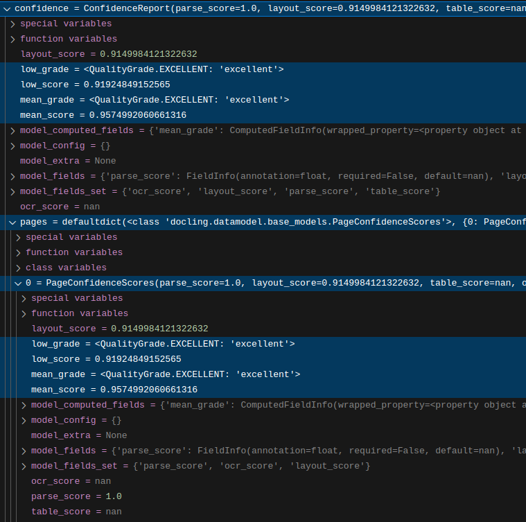

## Introduction

**Confidence grades** were introduced in [v2.34.0](https://github.com/docling-project/docling/releases/tag/v2.34.0) to help users understand how well a conversion performed and guide decisions about post-processing workflows. They are available in the [`confidence`](../../reference/document_converter/#docling.document_converter.ConversionResult.confidence) field of the [`ConversionResult`](../../reference/document_converter/#docling.document_converter.ConversionResult) object returned by the document converter.

## Purpose

Complex layouts, poor scan quality, or challenging formatting can lead to suboptimal document conversion results that may require additional attention or alternative conversion pipelines.

Confidence scores provide a quantitative assessment of document conversion quality. Each confidence report includes a **numerical score** (0.0 to 1.0) measuring conversion accuracy, and a **quality grade** (poor, fair, good, excellent) for quick interpretation.

!!! note "Focus on quality grades!"

    Users can and should safely focus on the document-level grade fields — `mean_grade` and `low_grade` — to assess overall conversion quality. Numerical scores are used internally and are for informational purposes only; their computation and weighting may change in the future.

Use cases for confidence grades include:

- Identify documents requiring manual review after the conversion
- Adjust conversion pipelines to the most appropriate for each document type
- Set confidence thresholds for unattended batch conversions
- Catch potential conversion issues early in your workflow.

## Concepts

### Scores and grades

A confidence report contains *scores* and *grades*:

- **Scores**: Numerical values between 0.0 and 1.0, where higher values indicate better conversion quality, for internal use only
- **Grades**: Categorical quality assessments based on score thresholds, used to assess the overall conversion confidence:
  - `POOR`
  - `FAIR`
  - `GOOD`
  - `EXCELLENT`

### Types of confidence calculated

Each confidence report includes four component scores and grades:

- **`layout_score`**: Overall quality of document element recognition 
- **`ocr_score`**: Quality of OCR-extracted content
- **`parse_score`**: 10th percentile score of digital text cells (emphasizes problem areas)
- **`table_score`**: Table extraction quality *(not yet implemented)*

### Summary grades

Two aggregate grades provide overall document quality assessment:

- **`mean_grade`**: Average of the four component scores
- **`low_grade`**: 5th percentile score (highlights worst-performing areas)

### Page-level vs document-level

Confidence grades are calculated at two levels:

- **Page-level**: Individual scores and grades for each page, stored in the `pages` field
- **Document-level**: Overall scores and grades for the entire document, calculated as averages of the page-level grades and stored in fields equally named in the root [`ConfidenceReport`](h../../reference/document_converter/#docling.document_converter.ConversionResult.confidence)

### Example

